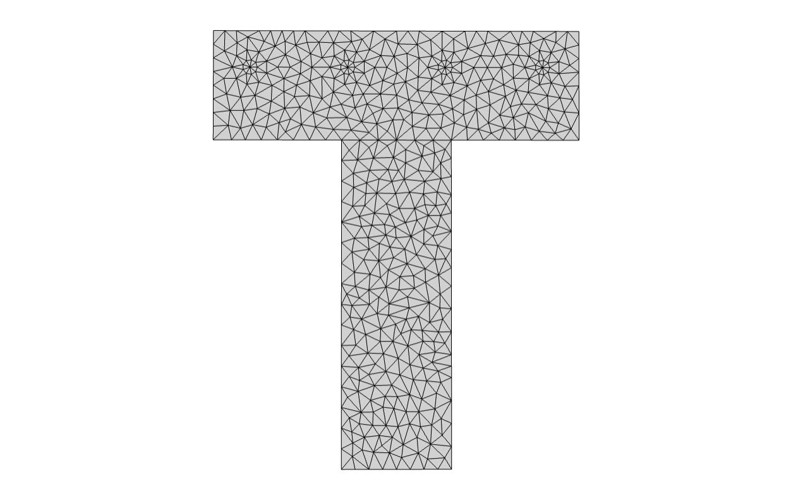

xsection.CompositeSection
=========================

   A composite T-section with steel reinforcement.

.. currentmodule:: xsection

.. autoclass:: CompositeSection

   
   .. automethod:: __init__

   
   .. rubric:: Methods

   .. autosummary::
   
      ~CompositeSection.__init__
      ~CompositeSection.add_patch
      ~CompositeSection.add_patches
      ~CompositeSection.create_fibers
      ~CompositeSection.exterior
      ~CompositeSection.integrate
      ~CompositeSection.interior
      ~CompositeSection.linspace
      ~CompositeSection.rotate
      ~CompositeSection.summary
      ~CompositeSection.torsion_warping
      ~CompositeSection.translate
   

.. rubric:: Attributes

.. autosummary::

   ~CompositeSection.centroid
   ~CompositeSection.elastic <elastic>
   ~CompositeSection.patches
   
Example
-------

.. tabs::

   .. tab:: Python
      .. code-block:: python

         import veux
         from xsection import CompositeSection
         from xsection.library import Rectangle, Circle
         from xara.units import iks

         d   = 18*iks.inch
         b   = 20*iks.inch
         t   =  6*iks.inch
         cv  =  2*iks.inch
         bar = Circle(0.4, z=2, mesh_scale=1, divisions=10)

         c = CompositeSection([
               Rectangle(t,d),
               Rectangle(b,t).translate([0, -d/2-t/2]),
               *bar.linspace([-(b/2-cv), -d/2-t/1.5], [b/2-cv, -d/2-t/1.5], 4, z=2)
            ])

         m = c.model
         artist = veux.create_artist(c.model)
         artist.draw_surfaces()
         artist.draw_outlines()
         veux.serve(artist)

   .. tab:: Matlab

      .. code-block:: Matlab 

         units = CreateUnits();

         xs = py.importlib.import_module('xsection');
         xl = py.importlib.import_module('xsection.library');

         d     = 18*xs.units.inch;
         b     = 20*xs.units.inch;
         t     =  6*xs.units.inch;
         cover =  2*xs.units.inch;

         flange = xl.Rectangle(t, d);
         web    = xl.Rectangle(b, t).translate({0, -d/2-t/2});

         section = xs.CompositeSection({flange, web});

         % Combine into one shape
         section = xs.CompositeSection({web, flange});
         
         %
         % Add reinforcement
         %
         
         % Create a shape to replicate. The parameter z=2 will ensure
         % this material takes priority over the concrete of the rectangular flange
         bar = xs.library.Circle(0.4, z=2, mesh_scale=1, divisions=int32(10));
         
         ri  = {-(b/2-cover), -d/2-t/1.5};
         rj  = {  b/2-cover , -d/2-t/1.5};
         top_bars = bar.linspace(ri, rj, int32(4));
         
         section.add_patches(top_bars);
         
         section = section.translate(section.centroid);
         
         %
         % Visualization
         %
         artist = veux.create_artist(section.model);
         artist.draw_outlines();
         artist.draw_surfaces(); %field=section.torsion_warping()
         artist.save("tee.glb");
         % veux.serve(artist);
         surfaceMeshShow(readSurfaceMesh("tee.glb"));

