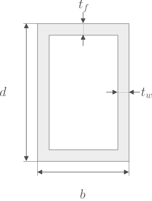

.. _HollowRectangle:

HollowRectangle
^^^^^^^^^^^^^^^

.. currentmodule:: xsection.library

.. autoclass:: HollowRectangle

   .. rubric:: Attributes

   .. autosummary::
   
      ~HollowRectangle.b
      ~HollowRectangle.d

   .. rubric:: Methods

   .. autosummary::

      ~HollowRectangle.create_fibers
      ~HollowRectangle.exterior
      ~HollowRectangle.interior
      ~HollowRectangle.linspace
      ~HollowRectangle.rotate
      ~HollowRectangle.summary
      ~HollowRectangle.translate