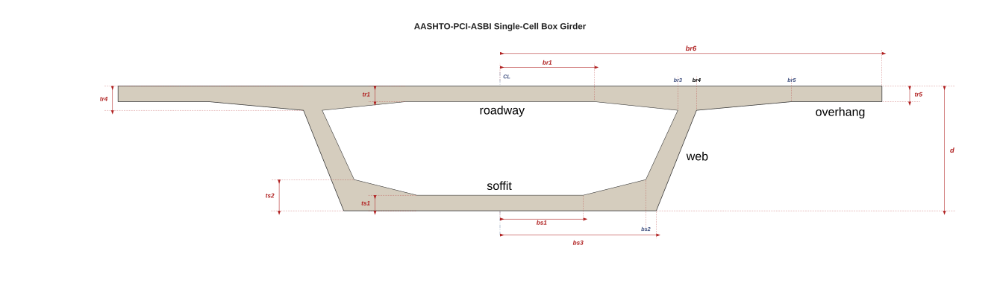

.. _SingleCellGirder:

SingleCellGirder
^^^^^^^^^^^^^^^^

.. currentmodule:: xsection.library

.. autoclass:: SingleCellGirder

   .. rubric:: Attributes

   .. autosummary::
         
      ~SingleCellGirder.d
      ~SingleCellGirder.br1
      ~SingleCellGirder.br2
      ~SingleCellGirder.tr1
      ~SingleCellGirder.tr2
      ~SingleCellGirder.tr3
      ~SingleCellGirder.tr4
      ~SingleCellGirder.tr5
      ~SingleCellGirder.bs1
      ~SingleCellGirder.bs2
      ~SingleCellGirder.bs3

